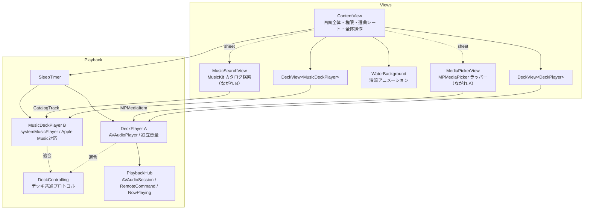

# せせらぎ (Seseragi) 設計書

## 1. 全体構成

外部依存なし。Apple 標準フレームワーク（SwiftUI / AVFoundation / MediaPlayer）のみで構成する。



選曲シートの提示は親（ContentView）が担う。`DeckView` は選曲の起点となる
クロージャ（`onSelect`）だけを受け取り、どのピッカー／検索を出すかは知らない。
これにより「ライブラリピッカー（MPMediaItem）」と「カタログ検索（CatalogTrack）」という
戻り値の型が異なる2方式を、ジェネリックな `DeckView` を壊さずに共存させている。

## 2. モジュールと責務

| クラス / 型 | 種別 | 責務 |
|---|---|---|
| `SeseragiApp` | `App` | エントリポイント |
| `ContentView` | `View` | 画面全体のレイアウト、権限リクエスト、全体再生/停止、タイマーメニュー |
| `DeckView<Deck>` | `View`（ジェネリック） | 1デッキ分の UI。`DeckControlling` 適合ならどのデッキでも表示できる。音量非対応デッキでは注記を表示。選曲は `onSelect` クロージャで親へ委譲 |
| `WaterBackground` | `View` | 清流の背景。グラデーション + `TimelineView`/`Canvas` による波アニメーション |
| `MediaPickerView` | `UIViewControllerRepresentable` | ながれ A 用。`MPMediaPickerController` の SwiftUI ラッパー |
| `MusicSearchView` | `View` | ながれ B 用。MusicKit でカタログ検索し `CatalogTrack` を返す。権限要求・デバウンス検索・複数選択 |
| `CatalogTrack` | `struct` | カタログ検索の選択結果（ストアID + 表示情報）。MusicKit 非依存の受け渡し用モデル |
| `DeckControlling` | `protocol` | **デッキ共通インターフェース**。再生操作・リピート・音量・フェード・表示を抽象化（選曲は含めない） |
| `DeckPlayer` | `ObservableObject` | ながれ A の再生エンジン（`AVAudioPlayer`）。キュー管理・リピート・独立音量・フェード |
| `MusicDeckPlayer` | `ObservableObject` | ながれ B の再生エンジン（`MPMusicPlayerController.systemMusicPlayer`）。カタログのストアIDキューで Apple Music / DRM 曲を再生 |
| `PlaybackHub` | シングルトン | AVAudioSession 設定（mixWithOthers）、割り込み処理、リモートコマンド、Now Playing 更新（ながれ A のみ管理） |
| `SleepTimer` | `ObservableObject` | おやすみタイマー。カウントダウンとフェードアウト（フェードは対応デッキのみ） |
| `RepeatMode` | `enum` | リピートモード（playlist / single / off）と表示情報 |

## 3. 再生エンジン設計

### なぜハイブリッド（AVAudioPlayer + systemMusicPlayer）か

| 手段 | 並列再生 | 独立音量 | DRM / Apple Music 曲 |
|---|---|---|---|
| `MPMusicPlayerController` | ❌ 1アプリ1系統のみ | ❌ | ✅ |
| `AVAudioPlayer` / `AVPlayer` | ✅ 複数可 | ✅ | ❌ |

どちらか一方では要件（並列 + なるべく全曲対応）を満たせないため、
**ながれ A = `AVAudioPlayer`（独立音量・フェード担当）、
ながれ B = `MPMusicPlayerController.systemMusicPlayer`（DRM / Apple Music 担当）**
のハイブリッドとする。

- systemMusicPlayer を選ぶ理由: `applicationMusicPlayer` / `applicationQueuePlayer` は
  アプリがバックグラウンドに移ると再生が停止するため、就寝用途に使えない。
  systemMusicPlayer は Music アプリ自身のエンジンなので画面を消しても再生が続く。
- 副作用: ながれ B のキュー・リピート設定は Music アプリと共有される。
- 両者の同時再生には AVAudioSession の `.mixWithOthers` が必須
  （ないと ながれ B の再生開始が ながれ A を割り込み停止させる）。

### DeckControlling プロトコル

2種類のデッキを UI（`DeckView<Deck>`）と `SleepTimer` から同一視するための
共通インターフェース。音量対応可否（`supportsVolume`）や、ピッカーにクラウド曲を
出すか（`allowsCloudItems`）といった能力の違いもプロトコル経由で表現する。

### DeckPlayer（ながれ A）の状態

```
items:        [MPMediaItem]   キュー（DRM フィルタ済み）
currentIndex: Int             再生中の曲位置
isPlaying:    Bool
currentTime:  TimeInterval    0.5 秒間隔の Timer で AVAudioPlayer から同期
duration:     TimeInterval
repeatMode:   RepeatMode      playlist / single / off
volume:       Double (0...1)  ユーザー設定音量
fade:         Double (0...1)  スリープタイマー用の減衰係数
```

実際の出力音量は `volume × fade`。タイマーのフェードアウトがユーザーの
音量バランス設定を破壊しないよう、2つの係数を分離している。

### 曲終了時の遷移（`audioPlayerDidFinishPlaying`）

```
single   → 同じ曲を頭から再生
playlist → 次の曲へ（最後の曲なら先頭へ戻る）
off      → 次の曲へ（最後の曲なら停止）
```

### 再生可否フィルタ（ながれ A のみ）

読める曲を最大化するため、事前除外は最小限にする:

1. ピッカーで `showsCloudItems = false`（実体のないクラウド曲を隠す）
2. 選曲後は `assetURL == nil` の曲だけを除外（`hasProtectedAsset` では弾かない。
   フラグが立っていても実際には読める場合があるため、実再生で判定する）
3. `AVAudioPlayer` の初期化に失敗した曲はその場でキューから外し次の曲へ

除外・スキップ件数は `skippedCount` に記録し、UI がアラートで
「ミュージックアプリでのダウンロード」または「ながれ B の利用」を案内する。

### MusicSearchView / MusicBrowseViews（ながれ B の選曲）

- `MusicAuthorization.request()` で Apple Music アクセスを要求（未許可なら設定導線）。
- **ライブラリタブ**: `MusicLibraryRequest<Playlist/Artist/Album/Song>` で自分のライブラリを閲覧。
  プレイリスト/アルバムは `.with([.tracks])`、ライブラリのアーティストは
  `MusicLibraryRequest<Song>` を `artistName` でフィルタして曲一覧へ。
- **検索タブ**: `.searchable` の入力を `.task(id:)` で約350ms デバウンスし、
  `MusicCatalogSearchRequest(term:types:[Song, Playlist, Album, Artist])`（`limit = 8`）。
  カタログのアーティストは `.with([.topSongs])` で人気曲を出す。
- ナビゲーションは `BrowseTarget`（Hashable enum）+ `navigationDestination` に集約。
  選択状態は `SongSelection`（EnvironmentObject）が保持し、順序を保って
  `onDone([Song])` で返す。曲単位の選択とコンテナ単位の「すべて追加」に対応。

### MusicDeckPlayer（ながれ B の再生）

- MusicKit の **`SystemMusicPlayer.shared`** を採用。`Queue(for: [Song])` に
  Song をそのまま渡すだけで、カタログ曲もライブラリ曲も再生できる
  （ストアID変換が不要になり、ライブラリ項目の再生失敗も防げる）。
- 状態は `player.state.objectWillChange` / `player.queue.objectWillChange` を購読して同期。
  再生位置のみ 0.5 秒タイマーでポーリング。
- 曲名・アーティスト・アートワークは `queue.currentEntry` から取得。
  アートワークは URL を `NSCache` でキャッシュして再取得を防ぐ。
- リピートは `MusicPlayer.RepeatMode`（.all / .one / .none）に 1:1 でマップ。
- 音量・フェードは iOS の制約で操作不可（`setFade` は no-op）。

### 描画パフォーマンス

- 波背景は `TimelineView(.animation(minimumInterval: 1/8, paused:))` の 8fps 更新。
  選曲シート表示中は `paused` で完全停止する。
- デッキカードは Material（すりガラス）ではなく半透明の単色塗りを使う。
  Material は動く背景の上ではブラーを毎フレーム再計算するため、GPU 負荷が大きい。

## 4. オーディオセッションとシステム連携（PlaybackHub）

PlaybackHub が管理するのは **AVAudioPlayer 系デッキ（ながれ A）のみ**。
ながれ B は Music アプリ自身が割り込み・ロック画面・バックグラウンドを処理する。

- **セッション**: `category = .playback, options = [.mixWithOthers]`
  （サイレントスイッチ無視・バックグラウンド再生・Music アプリとの同時再生）。
  再生開始時に `setActive(true)`。
- **割り込み**: `AVAudioSession.interruptionNotification` の `.began` で ながれ A を一時停止
  （ながれ B は Music アプリが自動処理）。
- **リモートコマンド / Now Playing**: ながれ A 向けに登録するが、
  `mixWithOthers` のセッションはロック画面に表示されないことが多い。
  実際のロック画面操作は ながれ B（ミュージックとして表示）が担う。

## 5. 並行性（Concurrency）

- 再生関連クラスはすべて `@MainActor`。UI と再生状態の同期を単純化する。
- `AVAudioPlayerDelegate` のコールバックと `Timer` / `NotificationCenter` からは
  `Task { @MainActor in ... }` でメインアクターに戻してから状態を更新する。

## 6. プロジェクト設定

| 設定 | 値 | 理由 |
|---|---|---|
| `UIBackgroundModes` | `audio` | 画面消灯後も再生を継続 |
| `NSAppleMusicUsageDescription` | あり | ミュージックライブラリアクセスに必須 |
| Deployment Target | iOS 17.0 | SwiftUI の新 API を利用 |
| 画面向き | Portrait のみ | 就寝時利用を想定した単純なレイアウト |
| Info.plist | 手書き（`GENERATE_INFOPLIST_FILE = NO`） | `UIBackgroundModes` などを明示管理 |

Xcode プロジェクトは Xcode 16 形式（`objectVersion = 77`、
`PBXFileSystemSynchronizedRootGroup`）。`Seseragi/` フォルダ配下の
ソースは自動的にターゲットへ同期されるため、ファイル追加時に
pbxproj の編集は不要。

## 7. エラー・エッジケースの方針

| ケース | 挙動 |
|---|---|
| 選んだ曲がすべて DRM | キューは空のまま、除外アラート表示 |
| 再生中にファイル読み込み失敗 | その曲をキューから外して次へ |
| 権限拒否 | 説明カード + 設定アプリへの導線 |
| 電話などの割り込み | 両デッキ一時停止（自動再開はしない: 就寝用途では安全側に倒す） |
| キュー1曲で playlist リピート | 同じ曲を繰り返す（single と同等の挙動） |
