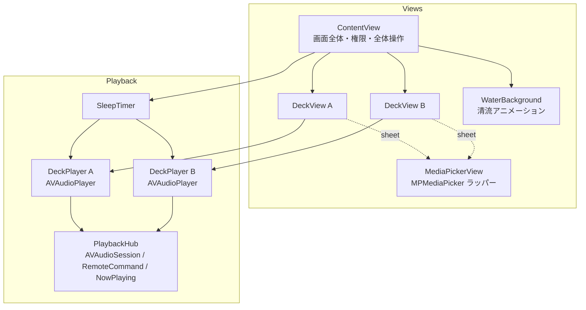

# せせらぎ (Seseragi) 設計書

## 1. 全体構成

外部依存なし。Apple 標準フレームワーク（SwiftUI / AVFoundation / MediaPlayer）のみで構成する。



## 2. モジュールと責務

| クラス / 型 | 種別 | 責務 |
|---|---|---|
| `SeseragiApp` | `App` | エントリポイント |
| `ContentView` | `View` | 画面全体のレイアウト、権限リクエスト、全体再生/停止、タイマーメニュー |
| `DeckView` | `View` | 1デッキ分の UI（曲情報・進行バー・操作・音量・選曲シート・除外アラート） |
| `WaterBackground` | `View` | 清流の背景。グラデーション + `TimelineView`/`Canvas` による波アニメーション |
| `MediaPickerView` | `UIViewControllerRepresentable` | `MPMediaPickerController` の SwiftUI ラッパー |
| `DeckPlayer` | `ObservableObject` | **1系統の再生エンジン**。キュー管理・再生制御・リピート・音量・進行状況 |
| `PlaybackHub` | シングルトン | AVAudioSession 設定、割り込み処理、リモートコマンド、Now Playing 更新 |
| `SleepTimer` | `ObservableObject` | おやすみタイマー。カウントダウンとフェードアウト |
| `RepeatMode` | `enum` | リピートモード（playlist / single / off）と表示情報 |

## 3. 再生エンジン設計

### なぜ AVAudioPlayer ×2 か

| 手段 | 並列再生 | 独立音量 | DRM 曲 | 採用 |
|---|---|---|---|---|
| `MPMusicPlayerController` | ❌ 1系統のみ | ❌ | ✅ | 不採用 |
| `AVPlayer` ×2 | ✅ | ✅ | ❌ | 可（機能は同等） |
| **`AVAudioPlayer` ×2** | ✅ | ✅ | ❌ | **採用**（ローカルファイル再生に最適・実装が簡潔） |

2つの `DeckPlayer` が各自 `AVAudioPlayer` を保持する。
同一の `AVAudioSession`（category: `.playback`）上で両者は自動的にミックスされる。

### DeckPlayer の状態

```
items:        [MPMediaItem]   キュー（DRM フィルタ済み）
currentIndex: Int             再生中の曲位置
isPlaying:    Bool
currentTime:  TimeInterval    0.5 秒間隔の Timer で AVAudioPlayer から同期
duration:     TimeInterval
repeatMode:   RepeatMode      playlist / single / off
volume:       Double (0...1)  ユーザー設定音量
fade:         Double (0...1)  スリープタイマー用の減衰係数
```

実際の出力音量は `volume × fade`。タイマーのフェードアウトがユーザーの
音量バランス設定を破壊しないよう、2つの係数を分離している。

### 曲終了時の遷移（`audioPlayerDidFinishPlaying`）

```
single   → 同じ曲を頭から再生
playlist → 次の曲へ（最後の曲なら先頭へ戻る）
off      → 次の曲へ（最後の曲なら停止）
```

### DRM フィルタ

選曲直後に `assetURL != nil && !hasProtectedAsset` でフィルタし、
除外件数を `skippedCount` に記録して UI がアラートを出す。
また読み込み失敗（`AVAudioPlayer` 初期化エラー）した曲はキューから取り除いて次の曲へ進む。

## 4. オーディオセッションとシステム連携（PlaybackHub）

- **セッション**: `category = .playback`（サイレントスイッチ無視・バックグラウンド再生）。
  再生開始時に `setActive(true)`。
- **割り込み**: `AVAudioSession.interruptionNotification` の `.began` で両デッキを一時停止。
- **リモートコマンド**: play / pause / togglePlayPause を両デッキ一括操作に割り当て。
  next / previous は 2 デッキのどちらを指すか曖昧なため無効化。
- **Now Playing**: 両デッキの曲名を「曲A ✕ 曲B」に連結してタイトル表示。
  再生レートは「どちらかが再生中なら 1.0」。アートワークは代表デッキのものを表示。

## 5. 並行性（Concurrency）

- 再生関連クラスはすべて `@MainActor`。UI と再生状態の同期を単純化する。
- `AVAudioPlayerDelegate` のコールバックと `Timer` / `NotificationCenter` からは
  `Task { @MainActor in ... }` でメインアクターに戻してから状態を更新する。

## 6. プロジェクト設定

| 設定 | 値 | 理由 |
|---|---|---|
| `UIBackgroundModes` | `audio` | 画面消灯後も再生を継続 |
| `NSAppleMusicUsageDescription` | あり | ミュージックライブラリアクセスに必須 |
| Deployment Target | iOS 17.0 | SwiftUI の新 API を利用 |
| 画面向き | Portrait のみ | 就寝時利用を想定した単純なレイアウト |
| Info.plist | 手書き（`GENERATE_INFOPLIST_FILE = NO`） | `UIBackgroundModes` などを明示管理 |

Xcode プロジェクトは Xcode 16 形式（`objectVersion = 77`、
`PBXFileSystemSynchronizedRootGroup`）。`Seseragi/` フォルダ配下の
ソースは自動的にターゲットへ同期されるため、ファイル追加時に
pbxproj の編集は不要。

## 7. エラー・エッジケースの方針

| ケース | 挙動 |
|---|---|
| 選んだ曲がすべて DRM | キューは空のまま、除外アラート表示 |
| 再生中にファイル読み込み失敗 | その曲をキューから外して次へ |
| 権限拒否 | 説明カード + 設定アプリへの導線 |
| 電話などの割り込み | 両デッキ一時停止（自動再開はしない: 就寝用途では安全側に倒す） |
| キュー1曲で playlist リピート | 同じ曲を繰り返す（single と同等の挙動） |
